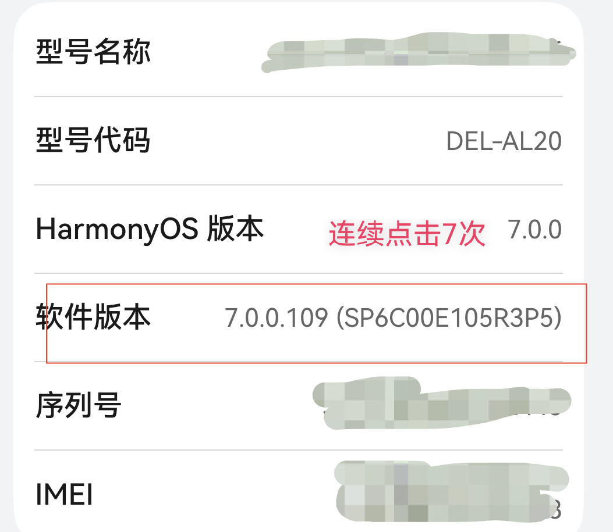
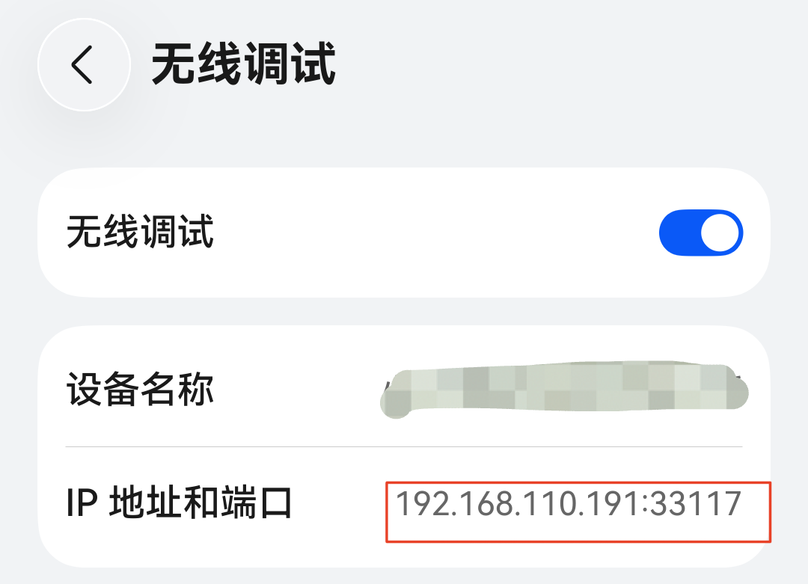

# ClawMate

**基于鸿蒙系统的端侧共生智能应用。**

ClawMate 将手机 GUI 操控、个人记忆与端侧模型推理结合起来：在你的授权下完成手机任务，把分散的生活记录整理成个人记忆，并据此提供主动提醒和个性化推荐。

应用采用 HarmonyOS NEXT、ArkTS / ArkUI 与 MNN / HiAI，支持云端和端侧 Agent。手机可以通过 HDC 直接控制自身，无需电脑参与设备操控。

[获取与编译](#获取与编译) · [功能与使用](#功能与使用) · [调试与常见问题](#调试与常见问题) · [项目结构](#项目结构)

## 获取与编译

### 应用商店下载

在鸿蒙手机的**应用商店中搜索 `ClawMate`**，即可下载安装。安装后在「我的」登录华为账号，并按要使用的功能完成配置。

### 使用 DevEco Studio 编译

准备 [DevEco Studio](https://developer.huawei.com/consumer/cn/deveco-studio/resources/)、HarmonyOS SDK 与 Native / CMake 工具链。本地模型推理需要 ARM64 真机；x86_64 模拟器使用原生接口桩，适合查看 UI。

```bash
git clone https://github.com/doulujiyao12/mobiinfra-oh.git
cd mobiinfra-oh
```

1. **打开工程**：在 DevEco Studio 中选择 **Open**，打开仓库根目录，等待依赖同步完成。
2. **准备构建配置**：根目录的 `build-profile.json5` 为本机配置，不随仓库提交。首次克隆时可使用下方示例创建，再按本机安装的 SDK 调整版本。
3. **配置签名**：连接已开启开发者模式的鸿蒙手机，在 **File → Project Structure → Project → Signing Configs** 中配置自动签名，登录自己的华为开发者账号，完成设备授权。
4. **编译应用**：选择 `entry` 模块、`default` 产品和 `debug` 构建模式，通过 **Build → Build Hap(s)/APP(s) → Build Hap(s)** 生成 HAP。
5. **安装调试**：选择连接的手机，点击 **Run** 或 **Debug**。构建产物位于 `entry/build/outputs/` 下。

签名与真机运行说明可参考 [华为 HarmonyOS 开发入门](https://developer.huawei.com/consumer/cn/develop-novice-guide/)。

<details>
<summary>首次克隆：build-profile.json5 示例</summary>

以下配置不含证书或密码。签名信息由 DevEco Studio 写入本机文件；SDK 版本需与所用开发环境一致。

```json5
{
  "app": {
    "signingConfigs": [],
    "products": [{
      "name": "default",
      "signingConfig": "default",
      "targetSdkVersion": "6.1.1(24)",
      "compatibleSdkVersion": "6.0.0(20)",
      "runtimeOS": "HarmonyOS",
      "buildOption": {
        "nativeCompiler": "BiSheng",
        "strictMode": {
          "caseSensitiveCheck": true,
          "useNormalizedOHMUrl": true
        }
      }
    }],
    "buildModeSet": [{ "name": "debug" }, { "name": "release" }]
  },
  "modules": [{
    "name": "entry",
    "srcPath": "./entry",
    "targets": [{ "name": "default", "applyToProducts": ["default"] }]
  }]
}
```

</details>

华为账号、地图等服务需要在 AppGallery Connect 中关联自己的应用、签名与服务配置，参见 [华为账号登录调试指南](docs/huawei-account-login-debug-guide.md)。包名的唯一配置源是 `AppScope/app.json5`；预置原生库位于 `entry/libs/arm64-v8a/`，更新时需与对应头文件及模型版本匹配。

## 功能与使用

| 能力 | 主要入口 | 用途 |
| --- | --- | --- |
| 手机 GUI 操控 | 聊天、任务、我的 → 手机 HDC | 启动应用、点击、输入、滑动与截图 |
| 定制 GUI 任务 | 任务 → 配置任务 | 用图形节点或 JSON 定义可重复执行的任务 |
| 个人记忆库 | 汇总 → 同步 / 图库分析 | 整理任务记录、图片与聊天中的个人信息 |
| 碰一碰分享画像 | 两台手机上的 ClawMate | 分享个人画像，并分析共同点 |
| 端侧模型推理 | 我的 → 模型与智能体 | 下载模型，选择 CPU / NPU，进行本地推理 |
| 主动服务 | 首页 → 为你提醒 / 猜你喜欢 | 根据个人记忆生成待办与个性化建议 |

### 1. 手机 GUI 操控：手机自己控制自己

App 内的 HDC 客户端通过 TCP 连接**本机无线调试端口**，完成密钥认证后，通过 HDC Shell 执行启动应用、截图、点击、文本输入和滑动等操作。截图交给 Agent 决策，再执行下一步动作。整个设备控制链路在手机上完成，无需 PC 代理或提前用 PC 配置。

**首次配置：**

1. 打开手机「设置 → 关于手机」，连续快速点击**软件版本 7 次**，开启开发者模式。
2. 连接 **Wi-Fi**，在系统设置中搜索并开启**无线调试**，记录页面上的 **IP 地址和连接端口**。
3. 进入「ClawMate → 我的 → 手机 HDC」，填写该手机的 IP 和端口，修改即保存。IP 自动更新不可用时，关闭「自动更新手机 Wi-Fi IP」后手动填写。
4. 点击「**仅测试连接**」，首次连接时手动允许手机系统弹出的调试授权请求。
5. 在「任务」页选择「**手机自己控制**」，随后即可运行 GUI 任务；「聊天」页的云端和本地 Agent 共用这一选择。

<p>
  
  
</p>

*图片中的地址仅为示例，请填写自己手机显示的地址。端口需要手动填写；重新开启无线调试后可能变化。*

「手机 HDC」还提供支付宝启动、截图、滑动测试，以及点击 / 聚焦 / 文本输入验证，适合在执行实际任务前检查设备能力。

**设备控制方式与模型推理位置独立。** 手机自控可使用云端或端侧 Agent；任务页 Workflow 的规划、决策和截图总结使用配置的云端服务。云端服务在「我的 → 模型与智能体 → 云端 Planner/Decider」配置，支持 OpenAI-compatible 接口。

### 2. 定制化 GUI 任务

把经常要做的操作保存成 Workflow，例如查看账单、整理订单或采集浏览记录。

1. 打开「**任务 → 配置任务**」，选择已有任务编辑，或在「新建任务」中选择「图新建」 / 「JSON」。点击任务列表条目的非开关区域，也可直接进入对应配置。
2. 选择场景，设置任务名称和描述，再编排 GUI 任务、明确的点击 / 滑动动作、截图总结、条件分支和循环。
3. 写清楚任务目标与停止条件，例如：**“打开支付宝，查看最近 3 条账单，整理商户、金额和日期。”**
4. 保存后返回任务列表，开启需要执行的条目并运行，也可在配置页单独运行任务。

执行结果、截图和 daily-log 可在 Workflow 文件查看入口中查看。JSON 配置的步骤类型为 `gui_task`、`gui_action`、`tool`、`if`、`loop`，字段定义见 [WorkflowTypes.ets](entry/src/main/ets/utils/WorkflowTypes.ets)。

### 3. 建立个人记忆库

个人记忆来自你授权采集和提供的信息。可以从以下来源逐步建立：

- **GUI 任务记录**：运行购物、外卖、聊天、出行等场景任务，保存结构化结果与摘要。
- **相册与截图**：在「汇总 → 图库分析」中选择图片，结合 OCR、图文分析和检索向量整理内容。相关服务在「我的 → 数据采集」配置。
- **日常聊天**：在聊天中提供自己的偏好、习惯或个人信息；同步时以你明确表达或确认的信息为依据提取记忆。

采集完成后，在「**汇总**」点击「**同步**」，将记录整理为可查询的记忆。聊天同步会处理最近 7 天内尚未处理的消息；汇总页可按场景查看来源与详情，首页展示生成的个人画像。

随后可以在聊天中提问，例如“我最近买过什么？”或“我有哪些饮食偏好？”。个人画像也会作为 Agent 的背景信息，帮助它理解你的需求。

记录与记忆索引保存在 App 沙箱中；使用云端分析服务时，相应文本或图片会发送给配置的服务。采集与服务配置可按需选择。图库流程和存储说明见 [采集流程](docs/gallery/collection-flow.md)与[存储格式](docs/gallery/storage-format.md)。

### 4. 碰一碰分享个人画像

ClawMate 接入鸿蒙 Share Kit 的一碰分享能力，可以将生成的个人画像分享给另一台手机上的 ClawMate。

1. 先完成记忆同步，建立自己的个人画像。
2. 在支持系统一碰分享的两台设备上打开 ClawMate，按系统引导碰一碰并确认分享。
3. 接收方可在聊天中查看收到的画像，并结合自己的画像分析共同偏好与相似之处。

分享内容为个人画像摘要；仅在双方同意时使用。此功能依赖设备和系统的一碰分享能力，开发包还需配置匹配的应用身份与签名。

### 5. 端侧模型推理部署

本地推理由 MNN / HiAI 驱动，支持本地聊天与视觉 Agent。

1. 进入「**我的 → 模型与智能体 → 本地模型下载**」，使用预设的 ModelScope 仓库或填写兼容的模型仓库地址，下载完整模型。
2. 在「**本地模型**」中选择下载的模型及运行方式。
3. 在「**聊天**」页切换到「**本地**」，加载模型后开始推理；GUI 控制方式仍沿用任务页的选择。

| 运行方式 | 行为 | 部署要求 |
| --- | --- | --- |
| 全 CPU | 本地模型各模块使用 CPU | 完整的 MNN 模型、权重、tokenizer 与配置 |
| 在线 NPU | 首次编译 NPU 图，后续复用缓存 | 支持对应 HiAI / NPU 能力的设备与模型 |
| 离线 OM | 加载模型目录 `om/` 下的预编译图 | 图文件与设备芯片、输入 shape 和引擎版本匹配 |

离线 OM 只替代配置为 NPU 的视觉分块，仍需保留 MNN 权重、CPU 分块和视觉 pre/post 等完整文件。缺少图文件或设备 / shape 不兼容时会明确报错。自导出模型需要与当前原生引擎接口匹配，提示词配置见 [本地模型提示词加载说明](docs/local_mnn/prompt-loading.md)。

### 6. 主动服务：主动提醒 + 猜你喜欢

在完成记忆同步和个人画像生成后，首页提供两类服务：

- **为你提醒**：根据记录整理待办和后续事项，支持查看详情、切换未完成 / 全部，以及标记完成。
- **猜你喜欢**：结合近期记录与个人偏好生成建议，支持「换一批」，查看推荐理由和可用的来源信息，并将适合执行的建议下发为 Agent 任务。

当前提醒和推荐主要在首页卡片中呈现。记忆持续更新后，可重新生成推荐，让服务跟随你的实际生活变化。

## 调试与常见问题

- **手机自控连接失败**：确认 Wi-Fi、无线调试和当前 IP / 端口；重新开启无线调试后检查端口是否变化，并完成系统授权。长任务还可能受系统后台运行额度限制。
- **查看执行日志**：在「我的」开启「**Debug**」，再查看聊天日志或「手机 HDC」日志；后者支持复制和清空。关闭 Debug 后，这两类日志不显示，也不记录。
- **模型输出异常或加载失败**：检查模型文件完整性及引擎版本；NPU 模式还需核对芯片和图文件。可用同一输入对比 CPU 与 NPU 输出定位问题。
- **需要电脑控制**：在任务页切换为「电脑控制」，用 PC 的 HDC 连接手机，启动 `entry/src/main/python/hdc_server.py`，并在「我的」配置 PC HDC Server 地址。它与手机自控使用独立的连接配置。

## 项目结构

```text
AppScope/                     应用身份、版本与资源
entry/src/main/ets/            ArkTS 页面、Agent、记忆管理与手机 HDC
entry/src/main/cpp/            MNN / HiAI 原生推理桥
entry/libs/arm64-v8a/          ARM64 原生库
entry/src/main/python/         可选的 PC HDC 后端与模型文件服务
entry/src/test/                单元测试
docs/                         专题文档
```

更多集成说明：[华为账号登录](docs/huawei-account-login-debug-guide.md) · [小艺个人记忆 A2A](docs/xiaoyi-a2a-integration.md)。

欢迎通过 Issue 反馈使用问题，通过 Pull Request 改进功能与文档。调试问题请附上应用版本、设备 / 系统版本、复现步骤及必要日志，分享前移除个人信息和密钥。
